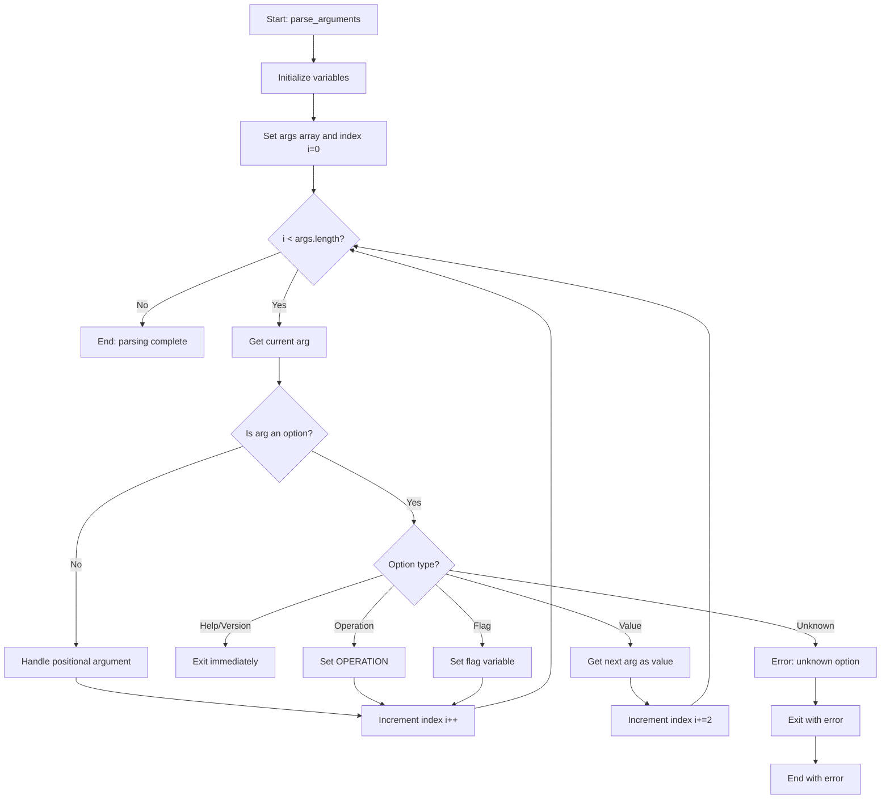

# Argument Parsing Algorithm Documentation

## Table of Contents
1. [Overview](#overview)
2. [Design Philosophy](#design-philosophy)
3. [Algorithm Flow](#algorithm-flow)
4. [Implementation Details](#implementation-details)
5. [Option Categories](#option-categories)
6. [Parsing Patterns](#parsing-patterns)
7. [Error Handling](#error-handling)
8. [Scaling Guidelines](#scaling-guidelines)
9. [Examples](#examples)
10. [Troubleshooting](#troubleshooting)

## Overview

The Docker Ops Manager argument parser implements a **single-pass, pattern-matching algorithm** that processes command-line arguments sequentially. Unlike traditional `getopts`-based approaches, this parser uses direct pattern matching for both short and long options, providing greater flexibility and maintainability.

### Key Characteristics
- **Single-pass processing**: Each argument is processed exactly once
- **Pattern-based matching**: Direct case statement matching for all options
- **Unified handling**: Short and long options handled in the same logic flow
- **Predictable behavior**: Clear precedence and error handling rules
- **Scalable design**: Easy to add new options and commands

## Design Philosophy

### 1. Simplicity Over Complexity
- Avoid complex multi-pass parsing
- Eliminate getopts dependencies and limitations
- Use straightforward pattern matching
- Maintain clear, readable code

### 2. Consistency in Design
- All options follow the same parsing pattern
- Uniform error handling across all option types
- Consistent naming conventions
- Predictable behavior for users

### 3. Maintainability Focus
- Easy to understand and modify
- Clear separation of concerns
- Comprehensive documentation
- Testable components

### 4. User Experience Priority
- Intuitive option combinations
- Clear error messages
- Helpful guidance for incorrect usage
- Backward compatibility

## Algorithm Flow



### Detailed Flow Steps

1. **Initialization**
   ```bash
   local args=("$@")  # Capture all arguments
   local i=0          # Initialize index
   ```

2. **Main Processing Loop**
   ```bash
   while [[ $i -lt ${#args[@]} ]]; do
       local arg="${args[$i]}"
       # Process each argument
   done
   ```

3. **Option Classification**
   - **Immediate Exit**: `--help`, `--version`
   - **Operation Setting**: `--start`, `--stop`, etc.
   - **Flag Options**: `--force`, `--trace`
   - **Value Options**: `--timeout`, `--yaml`
   - **Positional Arguments**: Non-option arguments

4. **Index Management**
   - **Single increment**: `i=$((i+1))` for flags and operations
   - **Double increment**: `i=$((i+2))` for value options
   - **Conditional increment**: Based on argument type

## Implementation Details

### Core Function Structure

```bash
parse_arguments() {
    local args=("$@")
    local i=0
    
    while [[ $i -lt ${#args[@]} ]]; do
        local arg="${args[$i]}"
        
        case "$arg" in
            # Pattern matching for all options
        esac
    done
}
```

### Option Pattern Matching

#### 1. Immediate Exit Options
```bash
--help|-h)
    print_help
    exit 0
    ;;
--version|-v)
    echo "Docker Ops Manager v$SCRIPT_VERSION"
    # ... version info
    exit 0
    ;;
```

#### 2. Operation Options
```bash
--start|--run|--up|-r)
    OPERATION="start"
    i=$((i+1))
    ;;
--stop|--down|-s)
    OPERATION="stop"
    i=$((i+1))
    ;;
```

#### 3. Flag Options
```bash
--force|-f)
    FORCE=true
    i=$((i+1))
    ;;
--trace|-T)
    TRACE_ENABLED=true
    i=$((i+1))
    ;;
```

#### 4. Value Options
```bash
--timeout|-t)
    if [[ $((i+1)) -lt ${#args[@]} ]]; then
        TIMEOUT="${args[$((i+1))]}"
        i=$((i+2))
    else
        print_error "Missing value for --timeout option"
        exit 1
    fi
    ;;
```

#### 5. Positional Arguments
```bash
*)
    # Handle based on current operation context
    if [[ -z "$OPERATION" ]]; then
        OPERATION="$arg"
    elif [[ "$OPERATION" == "generate" ]]; then
        YAML_FILES+=("$arg")
    else
        CONTAINER_NAMES+=("$arg")
    fi
    i=$((i+1))
    ;;
```

## Option Categories

### 1. Operations (Commands)
| Option | Short | Long | Description | Arguments |
|--------|-------|------|-------------|-----------|
| Generate | `-g` | `--generate` | Generate containers | YAML files |
| Install | `-i` | `--install` | Install containers | Container names |
| Update | `-U` | `--update`, `--refresh` | Update containers | Container names |
| Start | `-r` | `--start`, `--run`, `--up` | Start containers | Container names |
| Restart | `-R` | `--restart` | Restart containers | Container names |
| Stop | `-s` | `--stop`, `--down` | Stop containers | Container names |
| Status | `-S` | `--status`, `--state` | Show status | Container names |
| Clean | `-c` | `--clean`, `--delete`, `--remove` | Remove containers | Container names |
| List | `-l` | `--list` | List resources | Resource type |
| Nuke | `-n` | `--nuke` | Remove all resources | None |
| Environment | `-e` | `--env`, `--config` | Show environment | None |
| Logs | `-L` | `--logs` | Show logs | Container names |

### 2. Global Options
| Option | Short | Long | Description | Arguments |
|--------|-------|------|-------------|-----------|
| Help | `-h` | `--help` | Show help | None |
| Version | `-v` | `--version` | Show version | None |
| Force | `-f` | `--force` | Force operation | None |
| Timeout | `-t` | `--timeout` | Set timeout | Seconds |
| YAML | `-y` | `--yaml` | Specify YAML file | File path |
| Log Level | `-d` | `--log-level` | Set log level | Level |
| Trace | `-T` | `--trace` | Enable tracing | None |

### 3. Special Options
| Option | Long | Description | Arguments |
|--------|------|-------------|-----------|
| All | `--all` | Cleanup all containers | None |

## Parsing Patterns

### 1. Option Recognition Patterns

#### Short Options
- **Single character**: `-h`, `-v`, `-f`, `-T`
- **With value**: `-t 30`, `-y file.yml`, `-d DEBUG`
- **Operation with argument**: `-g docker-compose.yml`

#### Long Options
- **Single form**: `--help`, `--force`, `--trace`
- **Multiple forms**: `--start|--run|--up`
- **With value**: `--timeout 30`, `--yaml file.yml`
- **Special handling**: `--all` (positional argument)

### 2. Argument Context Patterns

#### Operation-Dependent Processing
```bash
if [[ -z "$OPERATION" ]]; then
    # First positional argument becomes operation
    OPERATION="$arg"
elif [[ "$OPERATION" == "generate" ]]; then
    # Collect YAML files for generate operation
    YAML_FILES+=("$arg")
elif [[ "$OPERATION" == "list" ]]; then
    # Resource type for list operation
    CONTAINER_NAMES+=("$arg")
else
    # Container names for other operations
    CONTAINER_NAMES+=("$arg")
fi
```

#### Value Option Patterns
```bash
--option|-o)
    if [[ $((i+1)) -lt ${#args[@]} ]]; then
        VARIABLE="${args[$((i+1))]}"
        i=$((i+2))
    else
        print_error "Missing value for --option"
        exit 1
    fi
    ;;
```

## Error Handling

### 1. Error Categories

#### Missing Values
```bash
print_error "Missing value for --timeout option"
exit 1
```

#### Unknown Options
```bash
print_error "Unknown long option: $arg"
print_info "Use --help to see available options"
exit 1
```

#### Invalid Arguments
```bash
print_error "Too many arguments for help command"
print_info "Use './docker_mgr.sh help [COMMAND]'"
exit 1
```

### 2. Error Recovery
- **Immediate exit** for critical errors
- **Helpful guidance** for user errors
- **Consistent error format** across all errors
- **Context-aware messages** based on operation

### 3. Validation Points
- **Option existence**: Check if option is recognized
- **Value presence**: Ensure required values are provided
- **Argument count**: Validate number of positional arguments
- **Operation context**: Verify arguments match operation type

## Scaling Guidelines

### 1. Adding New Operations

#### Step 1: Define the Operation
```bash
--new-operation|-N)
    OPERATION="new-operation"
    i=$((i+1))
    ;;
```

#### Step 2: Add to Validation
```bash
validate_operation() {
    local valid_operations=(
        # ... existing operations
        "new-operation"
    )
}
```

#### Step 3: Update Help System
```bash
print_help() {
    echo "  new-operation    -N, (description of operation)"
}
```

#### Step 4: Add Command Help
```bash
print_command_help() {
    case "$command" in
        new-operation|N)
            echo "Usage: ./docker_mgr.sh new-operation [options] [ARGUMENTS]"
            # ... detailed help
            ;;
    esac
}
```

### 2. Adding New Options

#### Flag Options
```bash
--new-flag|-F)
    NEW_FLAG=true
    i=$((i+1))
    ;;
```

#### Value Options
```bash
--new-value|-V)
    if [[ $((i+1)) -lt ${#args[@]} ]]; then
        NEW_VALUE="${args[$((i+1))]}"
        i=$((i+2))
    else
        print_error "Missing value for --new-value option"
        exit 1
    fi
    ;;
```

### 3. Adding New Argument Types

#### Special Positional Arguments
```bash
--special-arg)
    if [[ ${#SPECIAL_ARGS[@]} -eq 0 ]]; then
        SPECIAL_ARGS+=("$arg")
    else
        print_error "Too many special arguments"
        exit 1
    fi
    i=$((i+1))
    ;;
```

### 4. Best Practices for Scaling

#### Naming Conventions
- **Operations**: Use descriptive, action-oriented names
- **Options**: Use clear, unambiguous names
- **Short options**: Choose memorable, non-conflicting letters
- **Long options**: Use kebab-case for consistency

#### Documentation Requirements
- **Help text**: Clear, concise descriptions
- **Examples**: Practical usage examples
- **Arguments**: Specify required vs optional arguments
- **Dependencies**: Note any option dependencies

#### Testing Considerations
- **Unit tests**: Test each option individually
- **Integration tests**: Test option combinations
- **Error tests**: Test error conditions
- **Edge cases**: Test boundary conditions

## Examples

### 1. Basic Usage Patterns

#### Simple Operations
```bash
./docker_mgr.sh start                    # Start last container
./docker_mgr.sh -r my-container          # Start specific container
./docker_mgr.sh --stop nginx-app         # Stop specific container
./docker_mgr.sh -s                       # Stop last container
```

#### Operations with Arguments
```bash
./docker_mgr.sh generate docker-compose.yml
./docker_mgr.sh -g app.yml my-app
./docker_mgr.sh install nginx-app web-app
./docker_mgr.sh -i my-container
```

#### Mixed Options
```bash
./docker_mgr.sh -g -f docker-compose.yml
./docker_mgr.sh --start --force my-container
./docker_mgr.sh -r -t 30 -d DEBUG nginx-app
```

### 2. Complex Usage Patterns

#### Multiple Operations
```bash
# Not supported - only one operation per command
./docker_mgr.sh start stop  # Error: multiple operations
```

#### Option Combinations
```bash
./docker_mgr.sh -g -y docker-compose.yml -f -t 60
./docker_mgr.sh --generate --yaml app.yml --force --timeout 60
```

#### Positional Argument Handling
```bash
./docker_mgr.sh generate file1.yml file2.yml file3.yml
./docker_mgr.sh install container1 container2 container3
./docker_mgr.sh list containers
./docker_mgr.sh list images
```

### 3. Error Scenarios

#### Invalid Options
```bash
./docker_mgr.sh -x                    # Error: unknown short option
./docker_mgr.sh --invalid-option      # Error: unknown long option
```

#### Missing Values
```bash
./docker_mgr.sh -t                    # Error: missing timeout value
./docker_mgr.sh --yaml                # Error: missing YAML file
```

#### Invalid Arguments
```bash
./docker_mgr.sh help command1 command2  # Error: too many arguments
./docker_mgr.sh generate               # Error: missing YAML file
```

## Troubleshooting

### 1. Common Issues

#### "Invalid option" Errors
- **Cause**: Option not recognized by parser
- **Solution**: Check option spelling and ensure it's added to parser
- **Debug**: Add debug logging to see which pattern is being matched

#### Missing Argument Errors
- **Cause**: Required value not provided
- **Solution**: Ensure value follows option immediately
- **Debug**: Check argument array indexing logic

#### Unexpected Behavior
- **Cause**: Pattern matching conflicts
- **Solution**: Review case statement order and patterns
- **Debug**: Add logging to trace argument processing

### 2. Debugging Techniques

#### Add Debug Logging
```bash
parse_arguments() {
    local args=("$@")
    local i=0
    
    while [[ $i -lt ${#args[@]} ]]; do
        local arg="${args[$i]}"
        echo "DEBUG: Processing arg[$i] = '$arg'" >&2
        
        case "$arg" in
            # ... patterns
        esac
    done
}
```

#### Validate State
```bash
# After parsing, validate state
echo "DEBUG: OPERATION = '$OPERATION'" >&2
echo "DEBUG: CONTAINER_NAMES = '${CONTAINER_NAMES[*]}'" >&2
echo "DEBUG: YAML_FILES = '${YAML_FILES[*]}'" >&2
```

### 3. Testing Strategies

#### Unit Tests
```bash
test_parse_arguments() {
    # Test individual options
    parse_arguments --help
    # Verify exit code and output
    
    parse_arguments -g docker-compose.yml
    # Verify OPERATION and YAML_FILES
}
```

#### Integration Tests
```bash
test_option_combinations() {
    # Test multiple options together
    parse_arguments -g -f -t 30 docker-compose.yml
    # Verify all options are set correctly
}
```

#### Error Tests
```bash
test_error_conditions() {
    # Test error scenarios
    parse_arguments -x  # Should exit with error
    parse_arguments -t  # Should exit with missing value error
}
```

## Conclusion

The argument parsing algorithm provides a robust, scalable foundation for the Docker Ops Manager CLI. Its single-pass, pattern-matching approach ensures predictable behavior while maintaining flexibility for future enhancements.

### Key Success Factors
1. **Clear separation** of option types and processing logic
2. **Consistent patterns** for all option handling
3. **Comprehensive error handling** with helpful messages
4. **Scalable design** that accommodates new features
5. **Thorough documentation** for maintainability

### Future Enhancements
- **Subcommand support** for complex operations
- **Configuration file integration** for default options
- **Option validation** with custom validation functions
- **Automatic help generation** from option definitions
- **Interactive mode** for guided operation selection

This documentation serves as a comprehensive reference for understanding, maintaining, and extending the argument parsing system. 